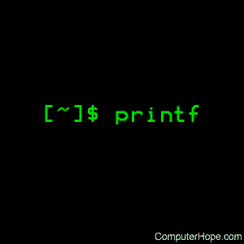

# printf


This is a printf project developed as part of the ALX Africa Software Engineering program.

## Table of Contents
- [Introduction](#introduction)
- [Files](#files)
- [Usage](#usage)
- [Contributors](#contributors)

## Introduction

This printf project aims to recreate the functionality of the standard C library function `printf()`. The `printf()` function is widely used in C programming for printing formatted output.

## Files

- `.gitignore`: Specifies intentionally untracked files to ignore.
- `_printf.c`: Contains the implementation of the custom printf function.
- `handle_flags.c`: Includes functions for handling different flags in the printf format string.
- `main.c`: Entry point of the program for testing the printf function.
- `main.h`: Header file containing function prototypes and necessary includes.
- `print_binary.c`: Includes functions for printing binary numbers.
- `print_custom_string.c`: Includes functions for printing custom string formats.
- `print_hex_oct.c`: Includes functions for printing hexadecimal and octal numbers.
- `README.md`: This file, containing project documentation.

## Usage

To use the printf function in your C program, include the `main.h` header file and call the `printf()` function with the desired format string and arguments.

Example:
```c
#include "main.h"

int main(void) {
    int num = 42;
    _printf("The answer to everything is: %d\n", num);
    return 0;
}
```

## Contributors

This project is developed and maintained by **Ephrem Belaineh**.
